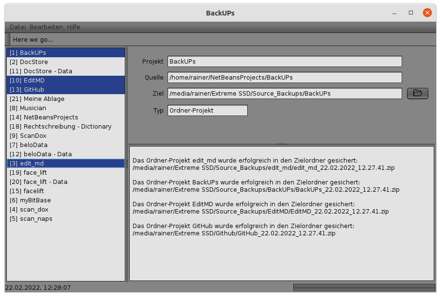

---
title: BackUPs
---  

Legen Sie beliebig viele Sicherungsprojekte an und erstellen Sie Ihre Backups
per Knopfdruck wann immer Sie wollen in wenigen Sekunden mit der kostenlosen
Software von Rainer Lüers...  

Mit **BackUPs** schützen Sie Ihre Daten sicher vor Verlust.
Die Backup-Lösung überzeugt durch ihren bewußt minimalistischen Funktionsumfang.
Benutzerfreundlichkeit und intuitive Bedienung erleichtern es, wichtige Daten
regelmäßig nach Ihren Vorgaben zu sichern.  

  
*Das Hauptfenster*  

## Systemvoraussetzungen

BackUPs wurde in Java mit dem JDK 17.01 programmiert und kann in jeder Umgebung ausgeführt
werden, die ein Java Runtime Environment (JRE) der Version 17.01 oder höher bereitstellt.
BackUPs wurde unter **Ubuntu 21.10** und **Windows 10** erfolgreich getestet.

## Download

Sie können BackUPs **kostenlos** herunterladen und nutzen.  

<a href="BackUPs_install.zip">BackUPs downloaden</a>  

BackUPs is completely free to use for both individuals and businesses,
and includes no ads or unwanted software.  

better safe then sorry ;-)

